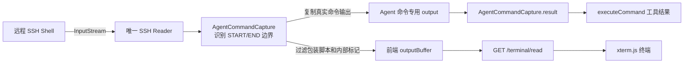
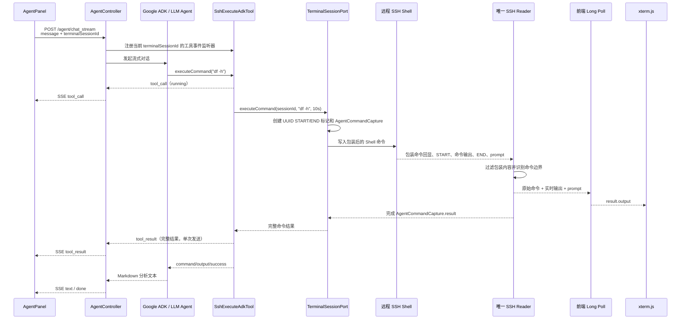

# Agent 执行 SSH 命令与前端终端展示机制

## 1. 文档目的

本文说明当前项目中一次 Agent SSH 命令从发起、执行、收集结果到前端展示的完整过程，重点回答以下问题：

1. Agent 调用 `executeCommand` 后，原始命令怎样显示在前端终端中？
2. SSH 返回的实时结果怎样同时显示在终端，并作为完整结果返回给 Agent？
3. Agent 命令结果为什么不会被前端 Long Poll 消费？
4. 智能体对话中的“执行命令”工具卡片来自哪里？
5. Long Poll 超时、断开、命令超时和缓冲区溢出分别怎样处理？

本文描述的是当前代码实现。主要相关文件如下：

| 层次 | 文件 | 主要职责 |
| --- | --- | --- |
| HTTP | `ai-ssh-terminal-server-trigger/.../AgentController.java` | 建立 Agent SSE 对话流，向前端发送文本和工具事件 |
| Agent 工具 | `ai-ssh-terminal-server-domain/.../SshExecuteAdkTool.java` | ADK 的 `executeCommand` 工具，发布工具开始/完成事件 |
| 终端领域服务 | `ai-ssh-terminal-server-domain/.../SshTerminalService.java` | 校验终端会话并调用终端端口执行命令 |
| 终端端口接口 | `ai-ssh-terminal-server-domain/.../ITerminalSessionPort.java` | 区分命令完整执行接口与前端 Long Poll 读取接口 |
| 终端基础设施 | `ai-ssh-terminal-server-infrastructure/.../TerminalSessionPort.java` | 包装并写入 Agent 命令，等待 Agent 专用结果 Future |
| 终端公共支持 | `ai-ssh-terminal-server-infrastructure/.../TerminalSessionPortSupport.java` | 唯一 SSH Reader、双路分发、命令边界识别和并发控制 |
| 终端 HTTP | `ai-ssh-terminal-server-trigger/.../SshTerminalController.java` | 提供 `/api/v1/ssh/terminal/read` Long Poll 接口 |
| 前端终端状态 | `../ai-ssh-terminal-client/src/state/remoteTerminal.ts` | 串行发起 Long Poll，并把 `output` 交给终端组件 |
| 前端终端组件 | `../ai-ssh-terminal-client/src/components/RemoteTerminalView.tsx` | 通过 xterm.js 展示远程终端输出和接收键盘输入 |
| 前端 Agent API | `../ai-ssh-terminal-client/src/api/agent.ts` | 解析 `chat_stream` 返回的 SSE 文本及工具事件 |
| 前端 Agent 面板 | `../ai-ssh-terminal-client/src/components/AgentPanel.tsx` | 展示工具卡片和 Markdown 格式的模型回复 |

## 2. 总体设计

一个终端会话只有一个 SSH `InputStream`，因此只能有一个 Reader 持续读取远端输出。Reader 每读取到一批数据，就在后端内部把数据分发给两个用途不同的缓冲区：



这里不是创建两个 SSH Reader，也不是让 Agent 再调用一次 `readAsync()`。同一批 SSH 数据由唯一 Reader 读取一次，然后在内存中复制到两条逻辑通道。

两条通道分别是：

| 通道 | 保存内容 | 消费者 | 消费方式 |
| --- | --- | --- | --- |
| Agent 命令通道 | 当前 Agent 命令边界内的完整输出 | `executeCommand` 工具 | 等待 `AgentCommandCapture.result` 完成 |
| 前端终端通道 | 适合终端展示的连续 SSH 输出 | 浏览器 xterm.js | `/terminal/read` Long Poll 分批消费 |

两套缓冲区属于同一个 `TerminalSessionContext`，共享 SSH 会话，但不会互相消费数据。

## 3. 一次 Agent 命令的完整时序



这次操作会在前端出现两种相关展示：

1. **终端区域**：显示命令本身、SSH 的真实输出和新的 Shell 提示符。
2. **智能体对话区域**：显示“执行命令”工具卡片、工具结果，以及模型根据结果生成的 Markdown 回复。

这两种展示使用不同的 HTTP 通道。终端显示来自 `/api/v1/ssh/terminal/read`，工具卡片和模型回复来自 `/agent/chat_stream`。

## 4. Agent 如何定位要操作的终端会话

前端调用 `POST /agent/chat_stream` 时提交 `terminalSessionId`。`AgentController` 在调用 Agent 前绑定当前线程：

```java
SshExecuteAdkTool.setCurrentTerminalSession(terminalSessionId);
```

`SshExecuteAdkTool.executeCommand()` 从 `InheritableThreadLocal<String>` 读取当前终端会话 ID，再调用：

```java
sshTerminalService.executeCommand(terminalSessionId, command);
```

Controller 在创建并订阅 Flowable 后清理请求线程上的绑定。不开启 SSE 时，工具通常在当前调用链中执行，能够读到这个值；开启 SSE 后，模型和工具可能切换到已经存在的线程池，`InheritableThreadLocal` 不保证传播到这些线程。

因此 Agent 会在用户当前打开的交互式 SSH Shell 中执行命令，能够继承该 Shell 现有的工作目录和环境。例如用户先在终端中执行：

```bash
cd /var/www/app
export APP_ENV=test
```

之后 Agent 执行 `pwd` 或读取 `$APP_ENV` 时，使用的仍是同一个 Shell 上下文。

当前实现依赖 `InheritableThreadLocal`。它适用于同步调用以及请求期间新建的子线程，不适用于所有线程池切换场景。

## 5. 为什么需要包装 Agent 命令

普通交互式 Shell 没有结构化协议。后端直接写入 `df -h\r` 后，只能收到连续字符流，无法仅凭 prompt 文本可靠判断：

- 命令从哪个字符开始输出；
- 命令什么时候真正结束；
- 命令的退出码是多少；
- 输出中的某个 prompt 样式字符串是否只是普通文本。

因此 `TerminalSessionPort.executeCommand()` 为每条 Agent 命令生成一个 UUID，并写入类似下面的包装脚本：

```bash
printf '\036SSH_AGENT_START_<uuid>\037\n'; \
eval '<转义后的原始命令>'; \
__ssh_agent_exit_code=$?; \
printf '\n\036SSH_AGENT_END_<uuid>:%s\037\n' "$__ssh_agent_exit_code"
```

其中：

- `\036` 是 RS 控制字符，对应 Java 中的 `\u001e`；
- `\037` 是 US 控制字符，对应 Java 中的 `\u001f`；
- UUID 让边界标记几乎不可能与正常命令输出冲突；
- START 标记确定真实输出的开始位置；
- END 标记确定真实输出的结束位置，并携带 `$?` 退出码；
- 原始命令放进 `eval` 前经过单引号转义，避免破坏包装脚本结构。

包装命令仍写入原来的 `ChannelShell`，没有创建新的 `exec channel`。这样既保留 Shell 上下文，也只需要维护一条 SSH 输出流。

## 6. 原始命令怎样显示在前端终端

远端交互式 Shell 通常会回显后端实际写入的整段包装脚本。如果直接把它交给前端，用户会看到 UUID、`printf`、`eval` 等内部实现内容。

`AgentCommandCapture.accept()` 会对 Reader 读到的数据进行以下处理：

1. START 标记出现前，暂不把包装脚本回显写入前端缓冲区。
2. 识别到完整 START 标记后，删除包装脚本回显和 START 标记。
3. 主动生成 `displayCommand + "\r\n"`，把真正的原始命令补回终端。
4. START 与 END 之间的真实 SSH 输出同时复制给 Agent，并原样交给前端。
5. 删除 END 标记和退出码，但保留 END 标记之后的 Shell prompt。

以 Agent 执行 `df -h` 为例，SSH 流内部可能包含：

```text
printf '...START...'; eval 'df -h'; ...
<START_MARKER>
Filesystem      Size  Used Avail Use% Mounted on
/dev/sda1        80G   31G   45G  41% /
<END_MARKER:0>
[root@server ~]#
```

前端终端最终看到的是：

```text
[root@server ~]# df -h
Filesystem      Size  Used Avail Use% Mounted on
/dev/sda1        80G   31G   45G  41% /
[root@server ~]#
```

前端没有额外调用 `terminal.write("df -h")` 来伪造显示。原始命令由后端在确认 START 标记已经到达后加入 `terminalOutput`，再通过正常 Long Poll 链路发送给 xterm.js。这样终端记录和真实 SSH 执行时机保持一致。

## 7. SSH 输出如何同时进入两个缓冲区

### 7.1 唯一 Reader

每个 `TerminalSessionContext` 生命周期内只启动一个 Reader 线程。它持续从 `ChannelShell` 的 `InputStream` 读取 UTF-8 字符，并调用：

```java
appendOutput(context, readBuffer, len);
```

使用 `InputStreamReader` 读取字符，可正确处理一个 UTF-8 中文字符被拆到两次底层字节读取中的情况。

### 7.2 Agent 命令专用捕获器

Agent 命令执行期间，`context.activeAgentCommand` 指向当前 `AgentCommandCapture`。捕获器拥有自己的状态：

| 字段 | 用途 |
| --- | --- |
| `startMarker` | 标识真实命令输出开始 |
| `endMarkerPrefix` | 标识真实命令输出结束，后面带退出码 |
| `displayCommand` | 前端终端要显示的原始命令 |
| `pending` | 暂存尚不能确定是否属于边界标记的数据 |
| `output` | Agent 专用完整命令结果缓冲区 |
| `result` | 命令完成时返回结果的 `CompletableFuture<String>` |
| `started` | 是否已经识别到 START 标记 |
| `completed` | 命令是否已完成或失败 |

SSH 是流式协议，一个边界标记可能被拆成多批数据，例如：

```text
第一批：...SSH_AGENT_EN
第二批：D_<uuid>:0...
```

所以捕获器不能只在每一批数据中做简单 `contains()`。`pending` 会保留“当前数据末尾与标记开头重叠的最长部分”，与下一批数据拼接后继续判断。

### 7.3 前端 Long Poll 缓冲区

捕获器的 `accept()` 返回经过过滤、允许展示给终端的数据，`appendOutput()` 再把它写进：

```java
context.outputBuffer
```

如果此时存在等待中的 `context.pendingRead`，`appendOutput()` 会立刻消费 `outputBuffer`，用 `DATA` 结果完成这个 Long Poll；如果没有等待请求，数据保留在 `outputBuffer`，由下一次 `/terminal/read` 直接取走。

核心逻辑可简化为：

```java
String incoming = SSH_READER_READ();

String terminalOutput;
synchronized (context.agentCaptureLock) {
    AgentCommandCapture capture = context.activeAgentCommand;
    terminalOutput = capture == null
            ? incoming
            : capture.accept(incoming); // 同时追加 capture.output
}

synchronized (context.eventLock) {
    context.outputBuffer.append(terminalOutput);
    if (context.pendingRead != null) {
        completeLongPoll(consumeOutputBuffer(context));
    }
}
```

真实代码还包含关闭状态检查、容量限制、溢出标记和锁外完成 Future 等保护逻辑。

## 8. Agent 结果为什么不会与 Long Poll 竞争

旧思路如果让 Agent 也调用 `readAsync(sessionId)`，就会产生竞争：

- 前端 Long Poll 和 Agent 都读取同一个 `outputBuffer`；
- 谁先完成读取，谁就会清空缓冲区；
- 同一会话只保留一个 `pendingRead`，新的读取还可能把旧读取置为 `REPLACED`；
- Agent 可能只读到登录提示或 prompt，前端也可能丢失命令输出。

`sessionId` 只能隔离不同终端会话，不能自动隔离同一会话中的多个消费者。两个消费者使用相同 `sessionId` 调用同一个消费型读取接口，仍然会竞争。

当前实现不再让 Agent 调用 `readAsync()`：

```java
// Agent 等待这个 Future
capture.result.get(timeoutSeconds, TimeUnit.SECONDS);

// 浏览器只消费这个 Future/Buffer
context.pendingRead;
context.outputBuffer;
```

因此两边的消费行为完全分开：

- 浏览器取走并清空 `outputBuffer`，不会修改 `capture.output`；
- Agent 完成并读取 `capture.result`，不会修改 `outputBuffer`；
- 两边看到的数据都来自同一个 SSH Reader，顺序保持一致；
- Long Poll 的 25 秒等待超时不会被当作 Agent 命令执行完成；
- Agent 的 10 秒命令总超时也不会停止前端正常的 Long Poll 生命周期。

## 9. 前端终端 Long Poll 如何展示数据

前端 `RemoteTerminal` 同一时间只允许一个读取请求在执行：

```ts
private polling = false;
```

`poll()` 调用：

```ts
const result = await terminalApi.read(this.sessionId);
```

HTTP 地址为：

```text
GET /api/v1/ssh/terminal/read?sessionId=<terminalSessionId>
```

后端 DTO 中的输出字段名是 `output`。前端根据 `status` 处理：

| 状态 | 含义 | 前端行为 |
| --- | --- | --- |
| `DATA` | 收到了 SSH 输出 | 调用 `emit(result.output)`，随后立即开始下一次 Long Poll |
| `TIMEOUT` | 25 秒内没有新输出 | 正常结束本次等待，立即开始下一次 Long Poll |
| `REPLACED` | 同一会话出现了更新的 Long Poll | 输出警告，再按循环逻辑处理 |
| `DISCONNECTED` | SSH 已断开或收到 EOF | 标记终端断开并停止轮询，等待用户点击重新连接 |
| `READER_ERROR` | SSH Reader 异常 | 标记终端断开并停止轮询，等待用户点击重新连接 |

HTTP 异常、网关错误或无法访问后端时，当前前端也会停止轮询，并提示用户手动重新连接，不会持续无效重试。

`RemoteTerminalView` 订阅输出后直接写入 xterm.js：

```ts
runtime.subscribe(data => terminal.write(data), ...);
```

xterm.js 负责解释 ANSI 控制序列、换行、光标移动、颜色及终端清屏指令。前端不解析 Agent 命令的开始/结束边界，因为这些内部标记已经在后端过滤。

## 10. 智能体对话中的工具卡片如何产生

工具卡片不依赖终端 Long Poll。它通过 Agent SSE 流产生。工具调用的开始和完成各发送一个事件，并不把命令输出拆成 token 或字符流；命令执行期间的实时输出由终端 Long Poll 展示。

### 10.1 注册监听器

`AgentController` 收到 `/agent/chat_stream` 请求后，以 `terminalSessionId` 注册工具事件监听器：

```java
SshExecuteAdkTool.observeExecutions(terminalSessionId, listener);
```

SSE 结束、超时或连接关闭后会关闭监听器，避免静态监听表持续增长。

### 10.2 工具开始事件

`SshExecuteAdkTool.executeCommand()` 在真正执行前生成唯一 `toolCallId`，并发布开始事件。Controller 转换成如下 SSE 数据：

```json
{
  "event": "tool_call",
  "toolCallId": "ssh_<uuid>",
  "toolName": "executeCommand",
  "command": "df -h",
  "arguments": {
    "command": "df -h"
  },
  "status": "running"
}
```

前端收到后创建一个状态为“执行中”的工具卡片。

### 10.3 工具完成事件

命令结束或失败后，工具发布相同 `toolCallId` 的完成事件：

```json
{
  "event": "tool_result",
  "toolCallId": "ssh_<同一个 uuid>",
  "toolName": "executeCommand",
  "command": "df -h",
  "content": "Filesystem ...",
  "status": "success"
}
```

前端通过 `toolCallId` 找到原来的卡片并更新：

- `running` 显示“执行中”；
- `success` 显示“已完成”；
- `error` 显示“失败”；
- 展开卡片后使用 `<pre>` 显示原始命令输出。

工具返回给 ADK/模型的数据则是一个 Map，主要字段为：

```json
{
  "command": "df -h",
  "output": "Filesystem ...",
  "success": true
}
```

模型读取这个完整结果后继续生成分析或建议。`ChatService` 调用不带 `RunConfig` 的三参数 `runner.runAsync(userId, sessionId, content)`，ADK 使用默认运行配置。`AgentController` 再把产生的 Event 转换成 `text` SSE 事件发送给前端。

## 11. 三类数据在前端的区别

| 数据 | 来源 | 传输接口 | 前端位置 | 是否进入 xterm.js |
| --- | --- | --- | --- | --- |
| Agent 原始命令 | 后端 `AgentCommandCapture.displayCommand` | `/terminal/read` Long Poll | 终端历史记录 | 是 |
| SSH 实时输出和 prompt | 唯一 SSH Reader | `/terminal/read` Long Poll | 终端历史记录 | 是 |
| 工具开始/完成状态 | `SshExecuteAdkTool` 事件监听器 | `/agent/chat_stream` SSE | 对话工具卡片 | 否 |
| 工具完整结果 | `AgentCommandCapture.result` 经工具事件发送 | `/agent/chat_stream` SSE，命令完成后一次发送 | 展开的工具卡片 | 否 |
| 模型分析回复 | Google ADK 事件 | `/agent/chat_stream` SSE | Markdown 对话消息 | 否 |

所以用户可能在两个地方看到相同命令输出：终端中看到的是实时 SSH 会话记录；工具卡片中看到的是交给 Agent 的完整命令结果。它们用途不同，传输链路也不同。

## 12. 并发控制与锁的职责

`TerminalSessionContext` 使用不同锁保护不同资源：

| 锁 | 保护对象 | 作用 |
| --- | --- | --- |
| `writeLock` | SSH `OutputStream` | 防止多个 HTTP 写请求把字节交叉写入 SSH |
| `agentCommandLock` | 单个会话内的 Agent 命令执行过程 | 保证同一终端一次只执行一条 Agent 命令，避免命令输出边界嵌套 |
| `agentCaptureLock` | `activeAgentCommand` 及捕获器内部状态 | 协调 Agent 调用线程与 SSH Reader 线程 |
| `eventLock` | `outputBuffer`、`pendingRead`、溢出状态 | 防止 Long Poll 检查缓冲区与注册等待请求之间丢通知 |

`agentCommandLock` 不会暂停 SSH Reader，也不会暂停前端 Long Poll。它只对同一终端中的多个 Agent 工具调用进行串行化。

代码尽量在锁外调用 `CompletableFuture.complete()` 或 `completeExceptionally()`，避免 Future 回调同步执行时重新进入终端代码，形成复杂锁关系或死锁。

## 13. Long Poll 的生命周期

`readAsync(sessionId)` 按以下顺序处理：

1. `outputBuffer` 已有数据：立即消费并返回 `DATA`。
2. Reader 已异常：立即返回 `READER_ERROR`。
3. SSH 已 EOF 或断开：立即返回 `DISCONNECTED`。
4. 已存在未完成的 Long Poll：记录旧 Future，创建新 Future，旧请求返回 `REPLACED`。
5. 注册新的 `pendingRead`。
6. 25 秒内有 SSH 输出：Reader 完成 Future，返回 `DATA`。
7. 25 秒内没有输出：定时任务完成 Future，返回 `TIMEOUT`。

`TIMEOUT` 只表示当前 HTTP 等待周期到期，不表示命令执行完成，也不表示 SSH 断开。前端收到后应立即建立下一次 Long Poll。

同一终端正常情况下只能有一个进行中的 Long Poll。前端的 `polling` 标志以及“上一个请求结束后才发下一个请求”的写法共同保证这一点。

## 14. 命令完成、退出码和错误处理

### 14.1 正常完成

Reader 识别到完整 END 标记后：

1. 截取 START 与 END 之间的数据；
2. 去除结果首尾仅用于边界分隔的换行；
3. 解析 END 标记中的退出码；
4. 完成 `AgentCommandCapture.result`；
5. 把 END 标记后的 Shell prompt 继续交给前端。

### 14.2 非零退出码

退出码不为 `0` 时，Agent 结果末尾会增加：

```text
[命令退出码: N]
```

`SshExecuteAdkTool.isExecutionSuccessful()` 会据此把工具结果标记为失败，使模型和工具卡片都能识别失败状态。终端区域仍显示远端真实输出。

### 14.3 Agent 命令超时

当前 `SshTerminalService` 的 Agent 命令总超时为 10 秒。超时后：

1. Agent 专用 Future 以异常结束；
2. 后端尝试向当前 Shell 写入 `Ctrl+C`；
3. 工具返回失败结果；
4. 前端 Long Poll 本身不因 Agent Future 超时而停止，后续远端输出仍可显示。

### 14.4 SSH 断开或 Reader 异常

连接关闭、EOF 或 Reader 异常时，后端会分别处理两类等待者：

- 完成前端的 `pendingRead`，返回 `DISCONNECTED` 或 `READER_ERROR`；
- 对 `activeAgentCommand.result` 调用 `completeExceptionally()`，让 Agent 立即失败。

这样 Agent 不必一直等到 10 秒命令超时，浏览器也能立即显示断开状态。

## 15. 两个缓冲区的容量和溢出策略

当前两个缓冲区的上限都为 2M 字符，但处理策略不同。

### 15.1 前端 `outputBuffer`

前端输出是持续流。浏览器长时间不读取且服务器输出过快时，后端会丢弃一部分旧数据，优先保留较新的终端输出，并在下一次 `TerminalReadResult` 中设置：

```json
{
  "bufferOverflow": true
}
```

前端记录警告“Terminal 输出过快，部分旧数据已丢弃”。

### 15.2 Agent `capture.output`

Agent 需要完整结果才能可靠分析，因此不能把截断数据当作成功结果。超过 2M 字符时：

- 这批数据仍可继续返回给前端终端显示；
- Agent 的 `result` 以“输出超过 Agent 可接收上限”异常结束；
- 工具卡片和模型会得到失败结果。

持续运行的 `tail -f`、`journalctl -f` 等命令不适合作为 Agent 的单次命令调用，应使用有界参数，例如 `tail -n 200` 或 `journalctl -n 200 --no-pager`。

## 16. 前端键盘输入与 Agent 命令的关系

用户在 xterm.js 中按键时，`terminal.onData()` 把字符发送到：

```text
POST /api/v1/ssh/terminal/write
```

前端的 Long Poll 不阻塞写请求；写操作使用自己的 Promise 队列保持键盘字符和提交命令的顺序。后端再通过 `writeLock` 保证单次写入不会与另一写请求发生字节级交叉。

Agent 命令也写入同一个交互式 Shell。`agentCommandLock` 只串行化 Agent 命令，不禁止用户在 Agent 执行期间继续敲键盘。因此，如果用户恰好在 Agent 命令执行过程中输入内容，远端 Shell 仍可能把这些输入交给当前进程。需要完全严格的交互隔离时，前端可在存在 `tool_call: running` 时暂时禁用终端输入，或后端进一步增加输入所有权控制。

## 17. 为什么不采用其他方案

### 17.1 不让 Agent 循环调用 Long Poll

Long Poll 是面向终端展示的消费型通道，一次返回只代表“当前有一批数据”或“本轮等待超时”，无法自然表示一条命令的完整生命周期。Agent 使用它既会与前端竞争，也容易在 prompt、登录提示或 25 秒 `TIMEOUT` 处错误结束。

### 17.2 不创建第二个 Reader

一个 `InputStream` 被两个线程并发读取时，每个字节只会被其中一个线程取走，结果会随机分裂，无法保证前端和 Agent 都看到完整输出。

### 17.3 不为 Agent 新建独立 SSH exec Channel

独立 exec Channel 能天然返回一条命令的结果，但不会继承当前交互式终端中通过 `cd`、`export`、激活虚拟环境等形成的 Shell 状态。当前方案选择在同一 Shell 内执行，并用边界标记获得结构化结果。

## 18. 排查问题时的检查顺序

### 18.1 对话中没有工具卡片

依次检查：

1. 模型是否真正调用了 `executeCommand`，而不是只在文本中描述命令；
2. `AgentController` 是否在调用 Agent 前注册了 `observeExecutions()`；
3. 请求中的 `terminalSessionId` 是否与工具实际使用的 ID 一致；
4. 浏览器 SSE 响应中是否包含 `tool_call` 和 `tool_result`；
5. 两个事件的 `toolCallId` 是否一致。

### 18.2 工具卡片有结果，但终端没有显示命令

依次检查：

1. `/terminal/read` Long Poll 是否仍在进行；
2. 前端 `RemoteTerminal` 是否处于 `paused`、`disconnected` 或 `closed`；
3. SSH Reader 是否仍在运行；
4. START 标记是否被识别；
5. `AgentCommandCapture.accept()` 返回的 `terminalOutput` 是否写入 `outputBuffer`。

### 18.3 终端有输出，但 Agent 得不到完整结果

依次检查：

1. Agent 是否调用了新的 `executeCommand()`，而不是旧的 `write() + readAsync()` 组合；
2. 注册 `activeAgentCommand` 是否发生在写入包装命令之前；
3. END 标记和退出码是否完整返回；
4. 命令是否超过 10 秒；
5. 命令输出是否超过 2M 字符；
6. 执行期间 SSH 是否断开或 Reader 是否异常。

### 18.4 出现大量 `REPLACED`

这表示同一 `sessionId` 存在并发 Long Poll。检查 React effect 是否重复订阅、旧终端组件是否未注销，以及是否有其他调用方直接请求 `/terminal/read`。Agent 当前不应调用该接口。

## 19. 一句话理解当前实现

SSH 输出只读一次；后端用 Agent 专用捕获器保存一条命令的完整结果，同时把过滤后的同一份实时输出送入前端 Long Poll 缓冲区；聊天工具卡片再通过独立 SSE 事件展示命令执行状态和结果。
